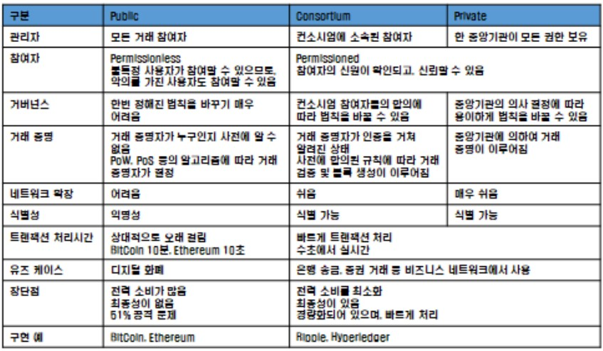
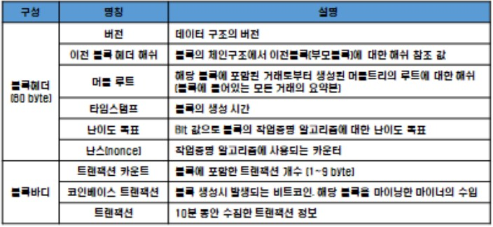
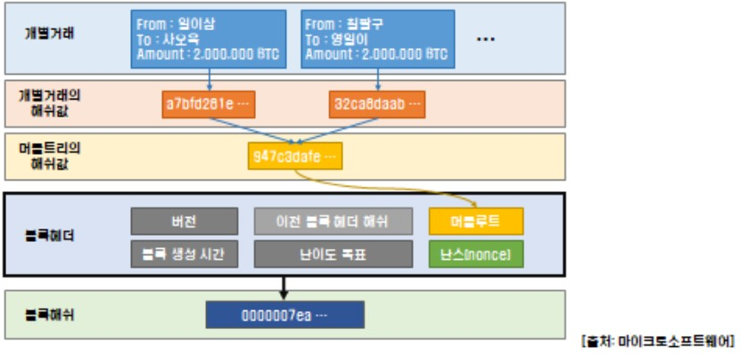
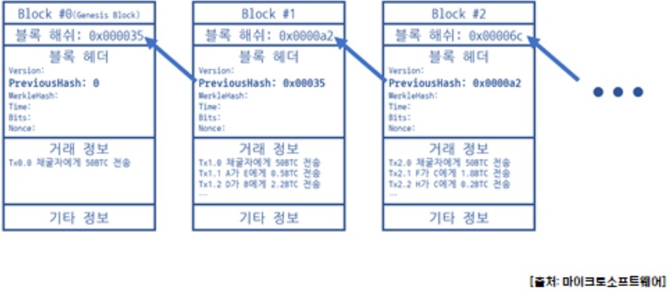
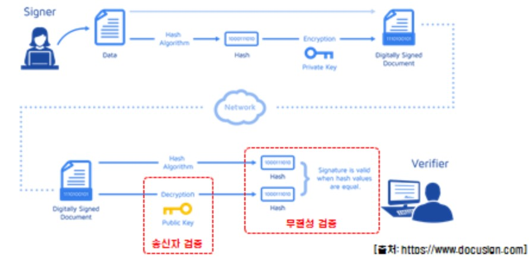
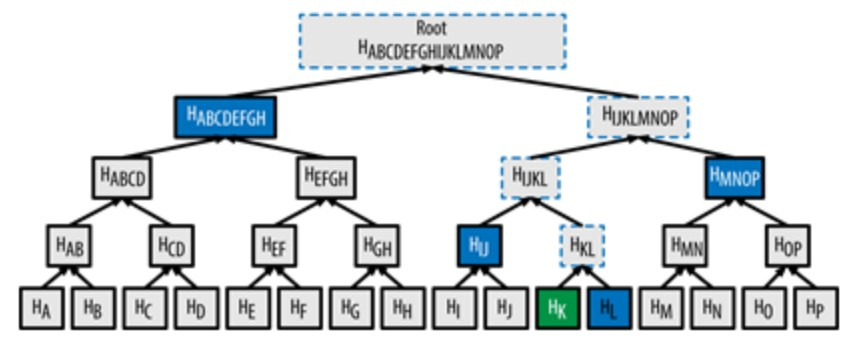
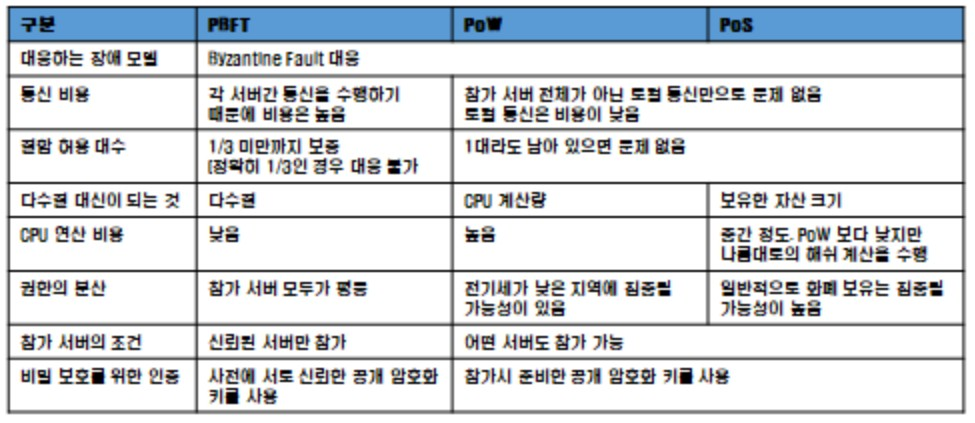

# 암호화

비도 = 암호화 강도

- 키가 없이 몇번을 통해서 열수 있나
- 키의 길이에 따라 결정된다

P ------>  A(key) ------> E

P --> E : 암호화

E --> P : 복호화

__키를 안전하게 만들고 안전하게 보관해야 한다__

- 기밀성을 유지하기 위해서는 __접근 통제__해야 한다

#### 키 운영 방법

##### 대칭키

- 키 하나가 유일하다
- 대칭키로 암호화 한 문서는 대칭키로만 풀 수 있다
- 관용 암호화 방식
- 키 분배 및 관리의 문제

##### 비대칭 키

- 대칭키 암호화의 단점을 개선하기 위해서 개발
- 암호화에 사용되는 키와 복호화에 사용되는 키가 다르다
- ~~유일키~~  --> 개인키 + 공개키
- ~~비밀키~~  --> 공개키는 외부에 오픈
- 소인수 분해의 어려움을 이용해 만들었다
- 이산대수를 이용
- 기밀성 보장 방법
  - (송신측) 수신자의 공개키를 암호화
  - (수신측) 수신자의 개인키로 복호화
- 인증, 원본증명, 부인방지를 보장하는 방법
  - (송신측) 송신자의 개인키로 암호화 => (전자) 서명
  - (수신측) 송신자의 공개키로 복호화 => (서명) 검증
- 비대칭 암호화 방식의 단점 : 대칭 암호화 방식에 비해 속도가 느리다(약 1000배)

#### 데이터 전달 과정

data를 보낼 때 Hash를 뽑고 data와 Hash값을 보내고

받는 사람이 받은 data의 Hash 값을 뽑고 그 값이 받은 Hash값과 같으면 그 데이터는 무결하다

#### 중간에 해쉬 값과 데이터 값이 둘다 바뀔 경우를 방지하기 위한 방법

A가 데이터의 해쉬 값을 A의 개인키로 암호화 하고

데이터를 받은 B는 A의 공개키로 복호화 한 해쉬 값과 받은 데이터의 해쉬 값을 비교한다

#### 원본증명

A의 개인키를 B의 공개키로 암호화 해서 B에게 전달한다

데이터를 받은 B는 개인키로 복호화 하고 A의 공개키로 다시 복호화 한다

A의 공개키로 복호화가 된다면 A가 보낸 데이터임을 인증

#### 키 전달 방식

A의 비밀키를 B의 공개키로 암호화 해서 보내고

데이터를 받은 B는 B의 개인키로 복호화 해서 A의 비밀키를 받아낸다

---

# 블록체인 활용 이해

## 블록체인이란

#### 고려사항

- 부정, 위변조 방지
- 정보전달의 지연으로 인한 불일치
- 네트워크를 자율적으로 유지, 운영하기 위한 추진력

#### 장점

- 공공제 성격이 좋다
- 기밀성 보다는 무결성과 가용성에 초점을 맞추는 서비스가 좋다
  - 도메인 서버에 대한 서비스
    - 도메인 정보가 투명해질 수록 도메인 변경에 대한 공격을 방지할 수 있다
- 속도가 향상된다
- 비용감소
  - 개별적인 노드의 기준으로 봤을 때 감소 된 것 같지만 네트워크 전체의 비용을 봤을 때 큰 차이가 없다
- 거래가 투명하다

#### 단점

- 처리 속도
  - 시간당 처리속도가 제한적
- 저장 공간
  - 블록이 계속 쌓여 나가는데 그 저장 공간을 어떻게 처리할 것인가

## 블록체인 분류

### Central Network

중앙집중화 네트워크

중앙에서 모든 데이터를 관리한다

### Distribute Network

데이터가 분산되어 저장되어 있다

#### Public(ex: bitcoin)	

- 동일한 프로토콜을 사용한다면 <u>누구나</u> 사용할 수 있다

​															--> 일반적으로 어떤 기능을 동작하는 기기(스마트폰, pc 등)

- Permissionless
- 네트워크 참여에 제한이 없음
- 누구나 블록체인 데이터를 읽고, 쓰고, 검증할 수 있음
- 예 : bitcoin, 암호화폐

#### Private(비즈니스에 적합)

- Permissioned
- 단일 조직에서 운영
- 읽기, 쓰기, 합의 과정에 참여할 수 있는 참여자가 미리 지정
- 중앙기관 한 곳이 모든 권한을 가지며, 네트워크에 참여하기 위해서는 해당 중앙기관의 허가가 필요
- 예 : 은행간 지급 결제 

#### Consortium Blockchain

- 여러 조직에서 운영
- 여러 기관들의 컨소시움으로 구성하는 블록체인
- 미리 선정된 노드에 의해서 컨트롤되는 반 중앙형 블록체인
- 미리 선정된 노드들이 권한을 가지며, 노드간 동의가 일어나야 거래가 생성
- 예 : 공급망, 주로 엔터프라이즈 영역에 적용

##### 장점

- 분산형 구조를 유지하면서 제한된 참여를 통해 보안 강화
- 네트워크 확장이 용이하고 거래 속도가 빠름

## 블록체인 핵심 기술

### Blockchain Technology Stack

#### Application Layer

실제 사용 화면, 사용자 인터페이스 개발자

---

#### Services and Optional Components

Server side에서 동작하는 부분

#### Protocol Layer

합의 알고리즘을 어떻게 쓸 것인가, 사이드 체인, permission 등

---

#### Network Layer

네트워크를 어떻게 구성할 것인가

#### Infrastructure Layer

채굴 방법, 네트워크 구성, 노드 구성 등 메인 렙을 구성

--> 네트워크 상에서 분산되어 동작

---

### 블록

- 유효한 트랜잭션 정보의 묶음
- 비트코인 블록 하나에 포함된 트랜잭션 개수 : 평균 1,400개
- 비트코인 블록 하나의 크기 : 평균 1.14MB
- 블록 높이 : 제너시스 블록[0] 이후 블록이 추가될 때마다 1씩 증가
- 블록 깊이[=confirm] : 블록[1]이 만들어진 후 새로운 블록이 추가될 때마다 1씩 증가
  - 몇번째 블록부터 몇개의 블록이 있는지 확인한다

비트코인 블럭의 구조

- 타임스탬프 
  - 블록의 순서를 확인하기 위해서 사용한다

- 난이도 

  - 블록이 생성되는 시간을 조절

  - 한명의 우월한 연산자가 독점하는 것을 방지

  - 00001234

    00012340

    --> 난이도가 3이면 앞에 선행되어야 하는 0의 갯수가 3개 이상이어야 한다

- 난스
  - 6개의 정보를 가지고 해쉬 값을 뽑아서 난이도에 맞는 해쉬 값이 나오면 채택
  - 5개의 정보는 동일하기 때문에 동일한 해쉬 값이 나오는 것을 방지하기 위해 난스의 값으로 변화를 준다
  - 작업증명
    - 열심히 일해서 값을 찾는 것
    - 값을 찾는 보상으로 코인을 받는다 -> 코인베이스 트랜잭션

- 트랜잭션은 누가 누구에게 주는지 정보가 있지만 코인베이스 트랜잭션은 받는 사람만 나온다

### 블록 해쉬

- 블록의 식별자 
- 블록 헤더 정보를 SHA256 해쉬 함수로 계사한 32바이트 길이의 숫자
- 이후의 거래 정보가 바뀌지 않았다는 것, 무결하다는 것을 증명하기 위해서 사용한다

트랜잭션의 해쉬 값, 그 해쉬와 다른 트랙잭션의 해쉬의 해쉬... 해쉬들을 계속 요약해서 나오는 마지막 해쉬를 머클루트에 넣어준다

거래 정보가 바뀌면 머클 루트의 해쉬 값도 바뀌고 블록의 해쉬 값도 바뀌게 되므로 해쉬 값이 일치 하지 않게 되는 것을 확인함으로써 무결성을 보장한다

### 블록체인

- 블록이 이어져서 만들어진 블록의 집합체
  
  - 블록으로 이루어진 링크드 리스트
  
  

블록의 통째로 해쉬 값의 위변조를 막기 위해서 링크드 리스트 구조로 블록을 형성한다

---

### 트랜잭션

- 블럭의 바디 부분에 위치
- 비트코인의 거래 내역
- 거래 후 남은 잔액이 비트코인이므로, 비트코인의 거래 내역을 기록한 트랜잭션이 곧 비트코인이 된다.

#### 코인베이스 트랜잭션

- 블록을 채굴한 사람에게 보상금을 지급해주는 트랜잭션
- 이전 출력이 존재하지 않음
- 100 확인(confirmation) 이전에는 사용할 수 없도록 제한
  - 해당하는 블록 이후에 100개의 블록이 더 생겨야만 보상으로 받은 코인을 사용할 수 있다

#### 일반 트랜잭션

- 코인베이스 트랜잭션을 제외한 모든 트랜잭션
- 블록체인의 자원이나 자산들이 변경이 발생하는 것

### UTXO(Unspent Transaction Output: 미사용 출력)

- 암호화폐를 저장하는 자료구조
- 분산환경의 자산을 저장하는 방식
- 출력[지급]은 됐으나 아직 당사자가 사용하지 않은 상태로 블록에 흩어져 있는 기록
- 당사자만 쓸 수 있도록 잠금 장치 = P2PK(Pay-To-Public-Key-Hash)

- 은행은 거래시 생기는 문제를 롤백해서 처리해주는 기능이 있는데 이 기능을 대신 해주는 것

- 사용자가 가지고 있는 자산을 여러개로 쪼개서 저장

  -> 이것을 수집하면 사용자의 전체 재산이 된다

  

#### 특징

- 다른 사람에게 일정량의 암호화폐를 받을 때 생성
- 받은 금액 그대로를 UTXO로 저장
- UTXO 안 일부 금액을 송금할 때는 새 UTXO를 생성하고 기존 UTXO는 파기

##### UTXO를 이용한 송금

### 전자 서명

- 공개키 시스템에서 송신자의 신원을 증명하는 방법
- 송신자가 자신의 개인키로 암호화한 메세지를 수신자가 송신자의 공개키로 해독
- 신뢰성, 무결성 부인방지

### 해쉬함수

- 임의 길이의 데이터를 고정 길이의 데이터로 매핑하는 함수
- 일방향성 : H[x] = h 를 만족하는 임의의 x를 찾는 것이 불가능
- 충돌회피성 : H[x] = H[y]를 만족하는 임의의 x, y를 찾는 것이 불가능 [=유일성]
- 데이터가 1bit라도 바뀌면 전혀 다른 결과가 나온다
- salt : 해쉬함수를 사용할 때 원문을 찾기 어렵게 뒤에 임의로 붙여주는 값

#### SHA-256[Secure Hash Algorithm 256 bit]

- 미국 NIST가 개발하여 연방정보처리표준 FIPS 180-4로 표준화한 SHA-2 규격의 일부
- 256비트 [32바이트] 길이의 해시값을 생성

#### RIPEMD-160 [RACE Integrity Primitives Evaluation Message Digest 160 bit]

- RPIEMD의 최초 버전에서 해시값이 128비트였던 것을 160비트[20바이트]로 확장하고 개량한 것

#### HASH 160

- SHA-256으로 생성한 해시값을 한 번 더 RIPEMD-160을 해싱한 것

[해쉬알고리즘 사용하기](https://www.fileformat.info/tool/hash.htm)

### nonce

- 블록 헤더 중 유일하게 변경할 수 있는 정보
- 0에서 시작해서 작업증명이 완료될 때까지 1씩 증가
- 오버플로우가 발생하면 새로운 트랜잭션을 추가해서 재시도

### difficulty

- 출력된 해쉬값이 가지는 0 배열의 개수
- 2,016개 블록이 생성될 때마다 블록생성시간을 측정해 난이도를 조절 -> 10분당 1~2개의 블록이 생성되는 것을 보장
- 네트워크의 모든 노드가 동시에 블록을 만들 수 없게 하는 것

### 머클트리(Merkle Tree)

- 1979년 랄프 머클에 의해 개발된 이진 해쉬 트리 구조
- 리프 노드를 두개씩 짝지어서 해시값을 만들고 이렇게 만들어진 해시값을 또 다시 두개씩 짝지어 반복적으로 해시값을 생성 [리프 노드의 개수가 홀수라면 마지막 리프 노드를 복사해서 짝수를 만듦]
- 규모가 큰 데이터 집합의 완전성을 효율적으로 요약, 검증하는데 사용
- 머클루트만으로 트랜잭션의 유효성을 보장

### 합의

- 모든 참여자의 원장이 일치하는지 확인하는 메커니즘

#### 중앙 집중형에서의 합의

- 사용자는 중앙 집중하는 서비스를 신뢰해야 한다
- 빠른 서비스 제공이 가능
- 중앙 기관의 의도 또는 악의적인 사용자의 공격을 통해 기록 조작이 가능

#### 분산 환경에서의 합의

- 비잔틴 장군 문제 해결을 통해 신뢰도 있는 서비스를 제공하는 것

- 거래 및 거래 실행 순서에 대한 동의
- 동일한 원장을 유지하기 위하여 검증 참여자들의 상태를 동기화
- 악의적인 참여자 노드들은 격리

#### 합의 알고리즘

- 비잔틴 장군 문제를 해결함으로써 네트워크에 악의적인 노드가 존재하더라고 신뢰도 있는 시스템 제공을 보장

인증시도 회수제한

- 아이디 패스워드 입력 --> 서버로 전송 --> DB조회 --> 클라이언트 한테 성공/실패 정보를 전달
  - 아이디는 식별 정보, 패스워드는 인증정보
  - 다른 사람들이 사용하는 경우 입력한 아이디의 비밀번호가 맞는지 물어보는 시스템으로 견경됨
  - 사전 대입이나 무작위 대입 공격법으로 비밀번호를 알아 낼 수 있음
    - 방어방법 
      - 횟수제한 : 입력할 수 있는 횟수를 초과하면 성공/실패가 아니라 인증을 거부한다
      - CAPTCHA 항목 추가 --> 자동화 된 요청을 방지 : 사용자와의 상호작용을 통한 처리
      - 

#### 작업증명(Pow)

- 1993년 신시아 도ㅡ와 모니 나오에 의해 제안된 개념 - 서비스 거부 공격이나 스팸 등으로 서비스가 남용되는 것을 방지하기 위해 만들어진 기법으로 서비스를 신청하는 자에게 작지 않으면서도 처리 가능한 수준의 과제를 요구(예:CAPTCHA)
- 1999년 마르커스 야콥슨과 아리 쥬얼이 쓴 논문에서 처음으로 등장
- 사토시 나카모토가 처음으로 제안한 비잔틴 합의 알고리즘 --> 난스를 찾는 과정
- 작업 능력에 의해 채굴 능력이 결정
- 느린 속도와 낭비되는 에너지 문제가 심각

#### 지분증명(Pos)

- 대량 통화를 소유하고 있는 참가자는 그 통화 가치를 지키기 위해 시스템의 신뢰성을 손실하지 않을 것을 전제
- 에너지 문제를 해결하기 위해 나옴

### 보상

- 새로운 블록을 블록체인에 추가해 블록에 포함된 모든 거래를 유효한 거래로 확정시켜준 대가
- 비트코인에서의 보상은 새로 발행되는 비트코인과 해당 블록에 포함되는 거래의 거래 수수료의 합

#### 비트코인의 새로운 발행

- 채굴자가 블록을 처음 구성할 때 채굴자의 지갑으로 일정량의 비트코인이 입금되는 거래를 그 블록의 첫 거래로 추가하는 방식
- 새로 발행되는 비트코인은 최초의 50BTC에서 시작해서 블록체인에 21만개의 블록이 추가될 때마다 절반으로 줄어듦

#### 트랜잭션 수수료

- 모든 트랜잭션에는 수수료를 지불
- 수수료율 = 트랜잭션 수수료/ 트랜잭션 크기 -->채굴 우선순위 결정에 사용

### 네트워크

- 항상 가장 긴 체인을 옳은 것으로 간주
- 일시적으로 분기가 발생하더라도 이후 3~5개의 블록이  추가되는 과정에서 분기 상태가 해소되고 하나의 블록체인을 유지
- 채택되지 않은 블록에 포함된 거래는 다시 블록체인에 포함되지 않은 거래들과 동일하게 취급된다

### PoW(Proof of Work)

- 블록체인의 가장 기본적인 합의 알고리즘
- 가장 긴 블록체인을 합의하고 다른 기록을 폐기

- 비트코인, 이더리움에서 사용

#### 장점

참가자의 수에 영향을 받지 않고 얼마든지 사용이 가능

#### 단점

- 네트워크의 상태에 따라 일부분의 불일치가 생길 경우 최종성이 불확실하게 되거나 성능이 저하될 수 있음
- 채굴의 집중화와 독점화 문제
- 과도한 에너지 소비와 같은 문제 발생

### PoS(Proof of Stake)

- 채굴 시스템에서 사용자의 소유 지분이 블록 생성권의 지분율을 나타냄
- 포크가 발생했을 때, 더 많은 자산을 보유한 블록을 채택

- 이더리움의 4번째 단계인 Serenity에서 사용

#### 장점

- 지분율이 높으면 채굴 난이도가 낮아지기 때문에 Pow와 비교해 자원 소비가 적음

- Pow에 비해 블록의 생성 주기가 짧고 독점화를 막을 수 있음

  

#### 단점

- 지분율이 높은 사용자가 블록을 생성할 가능성이 높아 빈익빈 부익부 현상이 발생

### PBFT(Pracical Byantine Fault Tolerance)

- 프라이빗 블록체인에서 사용

- 약속된 행동을 하지 않는 비잔틴 노드가 존재할 수 있는 비동기 시스템에서 해당 분산시스템에 참여한 모든 노드가 성공적으로 합의를 이룰 수 있도록 개발된 합의 알고리즘

#### 최종성의 불확실성과 성능 문제를 해결

- 다수결로 의사결정 후 블록생성 --> 블록체인의 분기가 발생하지 않음
- 한번 확정된 블록은 변경되지 않음 --> 최종성 확보

#### 장애에 매우 강력한 내성을 가진 알고리즘

- 부정한 사용자라해도 과반수를 획득해야 함
- 프라이머리가 거짓말을 한다 해도 모든 참가자가 리더의 움직임을 감시해 거짓말이라고 판다한다면 다수결로 리더 교체를 신청 가능

#### 언제나 참가자 전원과 의사소통을 해야 함

- 네트워크의 모든 참가자를 미리 알고 있어야 함
- 참가자가 증가하면 통신량이 증가하고 처리량이 저하

  